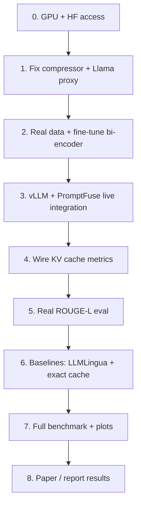

# PromptFuse Roadmap

Gap checklist from the **current prototype** to the **proposal targets** (validated research system with measured results).

Last updated: 2026-05-24

---

## Current baseline

| Area | Status |
|------|--------|
| Repo structure, config, README | Done |
| Segment compressor (perplexity + sentence drops) | Implemented; GPT-2 in `configs/default.yaml`, not Llama-3.2-1B; keep/drop policy inverted vs LLMLingua |
| Semantic unifier + FAISS canonical store | Implemented; base MiniLM only |
| Middleware → vLLM proxy | Implemented; not run against live vLLM |
| Evaluation harness | Partial — prompt-level ROUGE proxy, ratio sweeps, τ sweep; no real LLM outputs |
| Synthetic paraphrases | **500 / 50 clusters** (template generator; not GPT-4o) |
| Canonical inventory warmup | Script exists; run locally (`data/canonical_inventory/` gitignored) |
| ShareGPT / LMSYS datasets | Scripts exist; not downloaded |
| Bi-encoder fine-tuning | Script exists; not run |
| vLLM + LLMLingua baselines | Not installed / not wired |
| KV cache hit logging from vLLM | Partial — metrics field + proxy endpoint; `vllm_cache_hit` not populated |
| End-to-end speedup measurement | Not done |
| CPU artifact pipeline | Done — `run_cpu_pipeline.py`, `aggregate_results.py`, `tau_sweep.py` |
| Tests | Unit + middleware tests; inventory isolation via `tmp_path` in tests |

**Rough progress:** ~50–55% implementation scaffold, ~10–15% experimental validation.

---

## Phase 0 — Environment and access (do this first)

### 0.1 Machine setup

- [ ] **GPU for development** (proposal: RTX 3090-class) — proxy LM compression experiments
- [ ] **GPU for serving** (proposal: A100 40GB or cluster equivalent) — vLLM + Llama-3.1-8B-Instruct
- [ ] Confirm CUDA drivers and enough VRAM (~16GB+ for 8B with quantization; 40GB comfortable full precision)

### 0.2 Accounts and model access

- [ ] Create/login to [Hugging Face](https://huggingface.co) and request access to:
  - `meta-llama/Llama-3.2-1B` (compressor proxy)
  - `meta-llama/Llama-3.1-8B-Instruct` (target LLM)
- [ ] Set token locally:

  ```bash
  export HF_TOKEN="hf_..."
  huggingface-cli login
  ```

- [ ] (Optional) OpenAI API key if regenerating the synthetic set with **GPT-4o** as proposed

### 0.3 Python environment

```bash
cd /path/to/prompt_fuse
python -m venv .venv
source .venv/bin/activate
pip install -e ".[dev,vllm,llmlingua]"
```

- [ ] Verify `vllm` and `llmlingua` install on target GPU machine (often Linux + CUDA only; macOS may be dev-only for unifier/compressor)

---

## Phase 1 — Make each core component match the proposal

### 1.1 Token-level compressor (proposal § System Design #1)

**Proposal requires:**

- Proxy LM: **Llama-3.2-1B** (not GPT-2)
- Sentence-segment compression inspired by LLMLingua
- Evaluate at **25%, 40%, 55%** token reduction
- Quality measured against **downstream LLM outputs**, not prompt text
- Drop **low**-perplexity segments, keep **high**-perplexity (LLMLingua-style redundancy)

**Steps:**

1. [ ] Set `configs/default.yaml`:

   ```yaml
   compressor:
     proxy_model: meta-llama/Llama-3.2-1B
   ```

2. [x] Fix keep/drop policy in `segment_compressor.py` (keep high-PPL / informative segments; drop low-PPL)
3. [ ] Run compressor on **multi-sentence** prompts (ShareGPT/LMSYS or synthetic with body text) and confirm ≥30% reduction at 40% target:

   ```bash
   python -c "
   from promptfuse.compressor import SegmentCompressor
   from promptfuse.config import CompressorConfig, Settings
   c = SegmentCompressor(Settings().load().compressor)
   prompt = open('data/long_prompt_sample.txt').read()  # multi-sentence workload
   for ratio in [0.25, 0.40, 0.55]:
       r = c.compress(prompt, compression_ratio=ratio)
       print(ratio, round(r.token_reduction, 3), r.segments_kept, '/', r.segments_total)
   "
   ```

4. [x] Set `compressor.max_length` to model context (1024 for GPT-2 in `configs/default.yaml`; raise for Llama-3.2-1B)
5. [ ] Tune segment-dropping logic if grammar breaks at 55% (manual inspection)
6. [ ] Record **p99 compression latency** per ratio (proposal: pipeline overhead <50ms p99)

**Gap:** Compressor logic exists; **Llama proxy, correct PPL policy, ratio sweep on real workloads, latency profiling** remain.

---

### 1.2 Semantic unifier (proposal § System Design #2)

**Proposal requires:**

- Fine-tuned **all-MiniLM-L6-v2** on paraphrase pairs
- FAISS retrieval, cosine threshold τ tuned for hit vs fidelity
- Warmup chooses **shortest-token** canonical per cluster
- Inventory built from **historical prompts** (ShareGPT/LMSYS), not only synthetic templates

**Steps:**

1. [x] Expand synthetic set to **500 paraphrases / 50 categories** (template generator)
2. [ ] (Optional) Regenerate with GPT-4o as proposed
3. [ ] Fine-tune bi-encoder on GPU:

   ```bash
   python scripts/train_bi_encoder.py --data data/synthetic_paraphrases.json --epochs 3
   ```

4. [ ] Point config at fine-tuned model:

   ```yaml
   unifier:
     fine_tuned_encoder: models/finetuned-minilm
     similarity_threshold: 0.85  # tune after step 5
   ```

5. [x] **τ sweep tooling** — `scripts/tau_sweep.py` (run on synthetic 500; tune false-merge rate + downstream ROUGE still needed)
6. [ ] Rebuild inventory from **real workloads**:

   ```bash
   python scripts/prepare_datasets.py --max-samples 5000
   python scripts/build_canonical_inventory.py --prompts data/sharegpt_prompts.json
   python scripts/build_canonical_inventory.py --prompts data/lmsys_prompts.json
   ```

7. [ ] Verify warmup picks shortest form per cluster (audit `data/canonical_inventory/entries.json`)

**Gap:** Unifier runs with **base** MiniLM; **fine-tuning, real-data warmup, GPT-4o set, fidelity audit** remain.

---

### 1.3 Serving integration (proposal § System Design #3)

**Proposal requires:**

```
raw_prompt → compressor → unifier → vLLM (prefix cache) → response
```

Plus logging: **vLLM KV cache hit/miss**, TTFT, throughput, end-to-end latency.

**Steps:**

1. [ ] Start vLLM with prefix caching (GPU machine):

   ```bash
   python -m vllm.entrypoints.openai.api_server \
     --model meta-llama/Llama-3.1-8B-Instruct \
     --enable-prefix-caching \
     --port 8000
   ```

2. [ ] Start PromptFuse middleware:

   ```bash
   promptfuse-serve
   ```

3. [ ] Send test request through PromptFuse (port 8080), not directly to vLLM:

   ```bash
   curl http://localhost:8080/v1/chat/completions \
     -H "Content-Type: application/json" \
     -d '{"messages":[{"role":"user","content":"Summarize the following..."}]}'
   ```

4. [ ] Wire **real** vLLM cache metrics (parse logs, Prometheus, or TTFT drop on repeated prefixes)
5. [ ] Populate `vllm_cache_hit` in `logs/promptfuse.jsonl` and benchmark metrics
6. [x] Middleware JSONL logging (pipeline ms, token reduction, unifier hit) — extend with live cache hits
7. [x] Test isolation — temp inventory in `tests/test_core.py` and middleware tests

**Gap:** Middleware exists; **live vLLM stack + real KV cache measurement** remain.

---

## Phase 2 — Datasets and workloads (proposal § Datasets)

| Dataset | Proposal use | Status | Steps |
|---------|----------------|--------|-------|
| **ShareGPT** | Real prompt distributions | Not downloaded | `python scripts/prepare_datasets.py --dataset sharegpt` |
| **LMSYS-Chat-1M** | Production-like repeated prompts | Not downloaded | `python scripts/prepare_datasets.py --dataset lmsys` |
| **Synthetic 500/50** | Unifier precision stress test | **Done** (templates) | Optional: GPT-4o paraphrases |
| **Evaluation workload** | Repeated/similar prompts for cache hits | Not built | Replay script: paraphrase clusters + inter-arrival timing |

**Concrete steps:**

1. [ ] Download ShareGPT + LMSYS samples (start with 1k–10k prompts each)
2. [ ] Build **replay workload JSON**: groups of paraphrases + realistic inter-arrival timing
3. [ ] Run warmup inventory on **combined** historical prompts before live eval
4. [ ] Hold out 10–20% of clusters for τ / threshold tuning only
5. [x] Use `data/long_prompts.txt` as default compression benchmark (not single-line `sample_prompts.txt`)

---

## Phase 3 — Baselines (proposal § Baselines)

Run **four configurations** on the **same workload** with the **same target LLM**:

| # | Baseline | Config |
|---|----------|--------|
| 1 | **No compression, no prefix cache** | Raw prompts → vLLM without `--enable-prefix-caching` |
| 2 | **LLMLingua only** | Token compression, no unifier |
| 3 | **Exact-match prefix cache only** | vLLM default prefix cache, no PromptFuse |
| 4 | **Full PromptFuse** | compressor + unifier + vLLM prefix cache |

**Steps:**

1. [ ] Install LLMLingua: `pip install -e ".[llmlingua]"`
2. [ ] Add script (or extend benchmark) for LLMLingua at ratios 25/40/55%
3. [ ] Run each baseline on the same workload file
4. [ ] Store results under `results/` with timestamps (JSON/CSV)

**Current code status:**

| Mode in `promptfuse-benchmark` | Status |
|-------------------------------|--------|
| `no_compression` | CPU toggle only |
| `compression_only` | CPU toggle only |
| `promptfuse_full` | CPU toggle only |
| `llmlingua_only` | Placeholder (`unavailable`) |
| `exact_cache_only_stub` | Placeholder (`stub`) |

---

## Phase 4 — Evaluation against proposal goals

### 4.1 Metrics to hit

| Metric | Goal | Status |
|--------|------|--------|
| **Token reduction** | ≥30% | Not demonstrated (0% on `sample_prompts.txt`) |
| **KV cache hit rate** | ≥2× baseline | Not measured |
| **ROUGE-L** | ≥0.85 vs uncompressed | Not done on model outputs |
| **Latency overhead** | <50ms p99 | Fails on CPU benchmark (~63–76ms); not profiled with Llama |
| **End-to-end speedup** | ≥1.5× | Not measured |

### 4.2 Real ROUGE-L procedure (critical)

Current benchmark compares **prompt text** to prompt text. The proposal requires **model output** similarity.

1. [ ] For each eval prompt, run **uncompressed** through vLLM → `reference_output`
2. [ ] Run compressed-only, compressed+unified, and baselines → `hypothesis_output`
3. [ ] Compute ROUGE-L: `compute_rouge_l(reference_output, hypothesis_output)`
4. [ ] Repeat for ratios 0.25, 0.40, 0.55; plot quality–latency tradeoff

### 4.3 Cache hit rate procedure

1. [ ] Warm vLLM with N unique raw prompts → measure hit rate (low)
2. [ ] Replay paraphrase clusters through unifier → same canonical prefix → measure hit rate
3. [ ] Compute: `hit_rate_promptfuse / hit_rate_exact_match` ≥ 2.0

### 4.4 End-to-end speedup procedure

1. [ ] Fixed hardware, fixed concurrency (e.g. 8, 16, 32)
2. [ ] Measure throughput (req/s) and p50/p99 latency: baseline #3 vs full PromptFuse
3. [ ] Speedup = `throughput_promptfuse / throughput_baseline` (target ≥1.5×)

### 4.5 CPU artifacts (scaffolding — done)

- [x] `python scripts/run_cpu_pipeline.py` — ratio benchmarks + τ sweep + summary
- [x] `scripts/aggregate_results.py` — `summary.json` / `summary.csv`
- [x] `scripts/tau_sweep.py` — threshold diagnostics on synthetic 500
- [x] `scripts/compressor_diagnostics.py` — per-segment keep/drop diagnostics
- [ ] Populate `results/cpu_final/notes/status_report.md` with final numbers after GPU runs

---

## Phase 5 — Research questions (proposal § Research Questions)

| Research question | Experiment | Done? |
|-------------------|------------|-------|
| KV hit ratio from semantic dedup **on top of** compression? | Compare baseline #2 vs #4 with vLLM metrics | No |
| Compression aggressiveness vs latency/quality/throughput? | Sweep 25/40/55% + ROUGE + throughput curves | No |
| ≥30% token reduction, ROUGE-L ≥0.85, <50ms p99? | Joint eval on real datasets | No |

**Write-up:**

- [ ] Tables/plots for each metric vs baseline
- [ ] Ablations: compression-only, unifier-only, full stack
- [ ] Error analysis: false unifications, grammar breaks at 55%

---

## Phase 6 — Engineering polish

- [x] Test isolation (temp inventory per test run)
- [x] CPU pipeline reproducibility (seed, ratios, τ, config snapshot in `results/`)
- [x] Fix compressor PPL direction (validate on long prompts: run benchmark / CPU pipeline)
- [ ] Add `ROADMAP.md` checkbox updates as phases complete
- [ ] Document cluster deployment (SLURM/job script if using university A100)
- [ ] Optional: Docker Compose for vLLM + PromptFuse
- [ ] Optional: CI that runs unit tests only (no GPU)

---

## Suggested order of execution



**Week-style breakdown (adjust to schedule):**

1. **Days 1–2:** Phase 0 + fix compressor + Llama proxy + latency numbers
2. **Days 3–4:** Data download, optional GPT-4o paraphrases, bi-encoder training, τ tuning
3. **Days 5–7:** vLLM deployment, middleware E2E, cache metric wiring
4. **Days 8–10:** ROUGE-L on real outputs, compression ratio sweep
5. **Days 11–14:** All baselines, throughput tests, figures for report

---

## Quick reference commands

```bash
# Data
python scripts/generate_synthetic_paraphrases.py --target-size 500 --clusters 50
python scripts/prepare_datasets.py --max-samples 5000
python scripts/train_bi_encoder.py --data data/synthetic_paraphrases.json
python scripts/build_canonical_inventory.py --prompts data/synthetic_paraphrases.json

# CPU evaluation (no GPU)
python scripts/run_cpu_pipeline.py
python scripts/tau_sweep.py --prompts data/synthetic_paraphrases.json
promptfuse-benchmark --prompts data/synthetic_paraphrases.json --compare-baselines

# Serving (GPU node)
python -m vllm.entrypoints.openai.api_server \
  --model meta-llama/Llama-3.1-8B-Instruct \
  --enable-prefix-caching --port 8000
promptfuse-serve

# Evaluation (GPU + custom output-ROUGE / throughput scripts — TBD)
promptfuse-benchmark --prompts data/lmsys_prompts.json --compare-baselines
```

---

## Bottom line

The **code structure matches the proposal outline**. What remains is mostly **GPU serving, correct compressor behavior, real datasets, baselines, and measured results** against the five target metrics.

Update checkboxes in this file as items complete.
